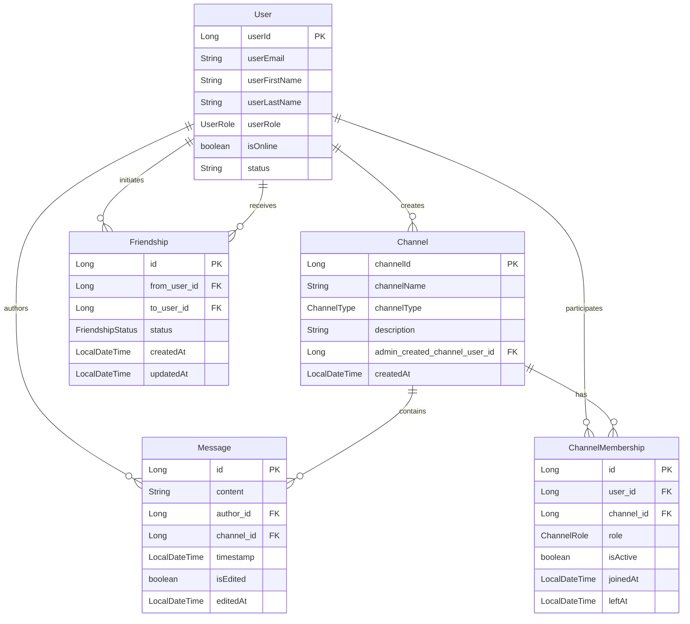

# StudentHub Application - Data Persistence Guide

## Overview

This document explains how Channels, Messages, and Friends are persisted in the StudentHub application, including the database schema, API endpoints, and basic functionality usage.

## Database Architecture

### Entity Relationships



## 1. Channels Persistence

### Database Table: `channel`
- **Primary Key**: `channelId` (Auto-generated)
- **Name**: `channelName` (Required, String)
- **Type**: `channelType` (Enum: PUBLIC_FORUM, PRIVATE_GROUP, DIRECT_MESSAGE)
- **Description**: `description` (Optional, String)
- **Admin**: `admin_created_channel_user_id` (Foreign Key to User)
- **Created**: `createdAt` (Auto-generated timestamp)

### API Endpoints

#### Create Channel
```http
POST /channel/create
Authorization: Bearer <JWT_TOKEN>
Content-Type: application/json

{
  "channelName": "General Discussion",    // Required field
  "name": "General Discussion",           // Alternative field name
  "channelType": "PUBLIC_FORUM",          // Optional (defaults to PUBLIC_FORUM)
  "description": "General channel for discussions",
  "isPrivate": false                      // Alternative to channelType
}
```

**Important**: Either `channelName` or `name` field must be provided. The system uses `getChannelNameField()` method which returns `channelName` if available, otherwise `name`.

#### Join Channel
```http
POST /channel/join/{channelId}
Authorization: Bearer <JWT_TOKEN>
```

#### Get User's Channels
```http
GET /channel/my-channels
Authorization: Bearer <JWT_TOKEN>
```

#### Leave Channel
```http
DELETE /channel/leave/{channelId}
Authorization: Bearer <JWT_TOKEN>
```

### Channel Types
- `PUBLIC_FORUM`: Open channels anyone can join
- `PRIVATE_GROUP`: Invite-only channels
- `DIRECT_MESSAGE`: One-on-one messaging

## 2. Messages Persistence

### Database Table: `messages`
- **Primary Key**: `id` (Auto-generated)
- **Content**: `content` (Required, TEXT)
- **Author**: `author_id` (Foreign Key to User)
- **Channel**: `channel_id` (Foreign Key to Channel)
- **Timestamp**: `timestamp` (Auto-generated)
- **Edit Tracking**: `is_edited` (Boolean), `edited_at` (Timestamp)

### API Endpoints

#### Send Message
```http
POST /messages/send
Authorization: Bearer <JWT_TOKEN>
Content-Type: application/json

{
  "channelId": 1,
  "content": "Hello everyone!"
}
```

#### Get Channel Messages (Paginated)
```http
GET /messages/{channelId}?page=0&size=50
Authorization: Bearer <JWT_TOKEN>
```

#### Edit Message
```http
PUT /messages/{messageId}
Authorization: Bearer <JWT_TOKEN>
Content-Type: application/json

{
  "content": "Updated message content"
}
```

#### Delete Message
```http
DELETE /messages/{messageId}
Authorization: Bearer <JWT_TOKEN>
```

### Real-time Messaging
- **WebSocket Endpoint**: `/ws`
- **Channel Topic**: `/topic/channel/{channelId}`
- **STOMP Protocol** with SockJS fallback

## 3. Friends Persistence

### Database Table: `friendships`
- **Primary Key**: `id` (Auto-generated)
- **From User**: `from_user_id` (Foreign Key to User who sent request)
- **To User**: `to_user_id` (Foreign Key to User who received request)
- **Status**: `status` (Enum: PENDING, ACCEPTED, REJECTED, BLOCKED)
- **Timestamps**: `created_at`, `updated_at` (Auto-managed)

### Friendship States
- `PENDING`: Friend request sent but not responded to
- `ACCEPTED`: Both users are friends
- `REJECTED`: Friend request was declined
- `BLOCKED`: User blocked the other user

### API Endpoints

#### Send Friend Request
```http
POST /users/friend-request
Authorization: Bearer <JWT_TOKEN>
Content-Type: application/json

{
  "userId": 123
}
```

#### Accept Friend Request
```http
POST /users/friend-request/accept
Authorization: Bearer <JWT_TOKEN>
Content-Type: application/json

{
  "userId": 123
}
```

#### Reject Friend Request
```http
POST /users/friend-request/reject
Authorization: Bearer <JWT_TOKEN>
Content-Type: application/json

{
  "userId": 123
}
```

#### Get Friends List
```http
GET /users/friends
Authorization: Bearer <JWT_TOKEN>
```

#### Get Pending Friend Requests
```http
GET /users/friend-requests
Authorization: Bearer <JWT_TOKEN>
```

#### Remove Friend
```http
DELETE /users/friends/{userId}
Authorization: Bearer <JWT_TOKEN>
```

#### Search Users
```http
GET /users/search?q=john
Authorization: Bearer <JWT_TOKEN>
```

## Authentication Requirements

All endpoints (except `/auth/**`) require JWT authentication:

```http
Authorization: Bearer <your_jwt_token>
```

The JWT token contains the user's email, which is used to identify the authenticated user in all operations.

## Common Error Resolution

### "Channel name is required" Error
This error occurs when the frontend sends a request without the `channelName` or `name` field. Ensure your request includes:

```json
{
  "channelName": "Your Channel Name"  // Required
}
```

### 403 Forbidden Errors
- Ensure JWT token is valid and not expired
- Check that the `Authorization` header is properly formatted
- Verify user exists in the database

### Friends List Hibernate Errors
The previous casting errors have been fixed by updating JPQL queries to use proper parameter binding instead of hardcoded enum values.

## Frontend Integration Tips

1. **Always include authentication headers** in requests
2. **Use proper field names** as specified in DTOs
3. **Handle pagination** for messages (default: 50 messages per page)
4. **Implement WebSocket** for real-time messaging
5. **Validate required fields** before sending requests

## Database Connection
- **URL**: jdbc:mysql://localhost:3306/studenthub
- **Hibernate**: Auto-DDL enabled for development
- **Connection Pool**: HikariCP
